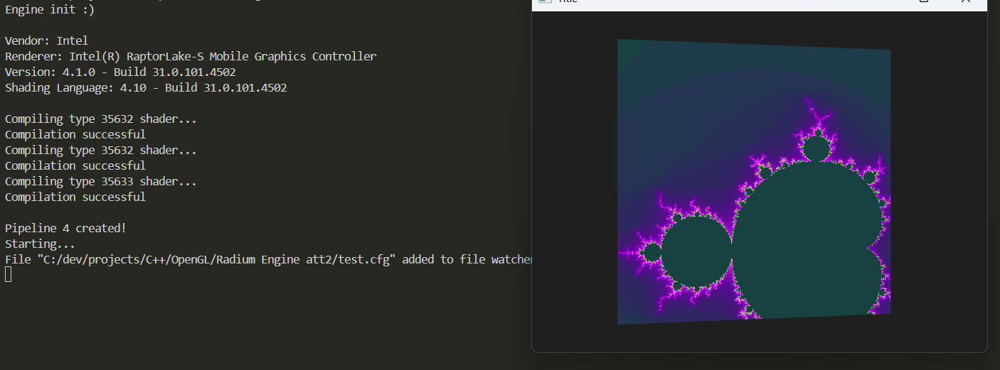

# Radium Engine v2
The original Radium Engine was created when I had very little experience with OpenGL. 
Working with it recently made me realize it's no longer useful, so I decided to completely rework it, and that's how this version came to be. 
The biggest difference is that it now uses an ECS-style architecture, making it more dynamic, robust, reusable, and modular.

The engine is very new, so a lot of features, like a 3D model loader, are still missing.

**As always, this is not a properly published project, so if you want to run it on your machine, you'll likely need to edit quite a few lines of code.**

  

